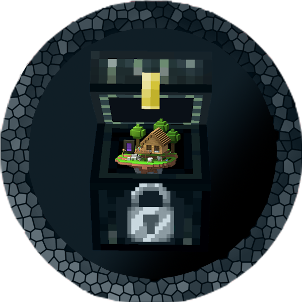

# Pocket dimensions Spigot (Paper) plugin

## Description

PocketHome is a plugin that adds private areas for all players where they can build freely.
Also, players can invite guests in their pockets or link pockets in one super-pocket

## Build

Get the source from GitHub and build it with Gradle:

```shell
git clone https://github.com/IPOleksenko/PocketHome.git
cd PocketHome/
./gradlew build
```

### Development server

There is available to start a development server:

```shell
./gradlew runServer
```

## Contributing

Pull requests are welcome. For major changes, please open an issue first
to discuss what you would like to change.

## Authors

- [IPOleksenko](https://github.com/IPOleksenko) (owner)
- [rvbsm](https://github.com/rvbsm)

## License

This project is licensed under the [MIT License][license].

[license]: ./LICENSE
